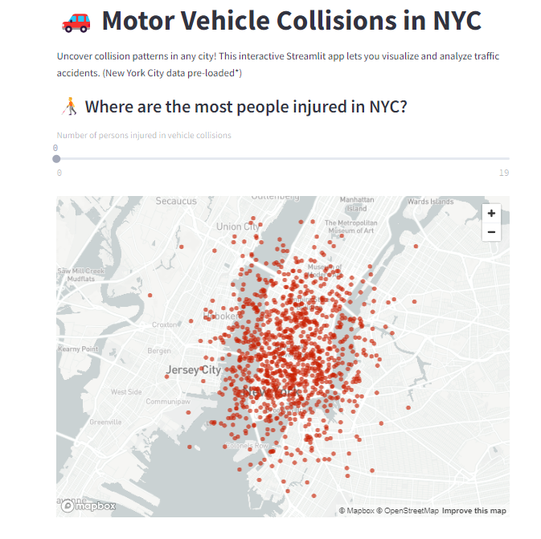
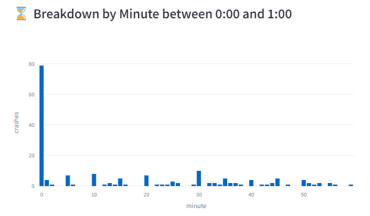
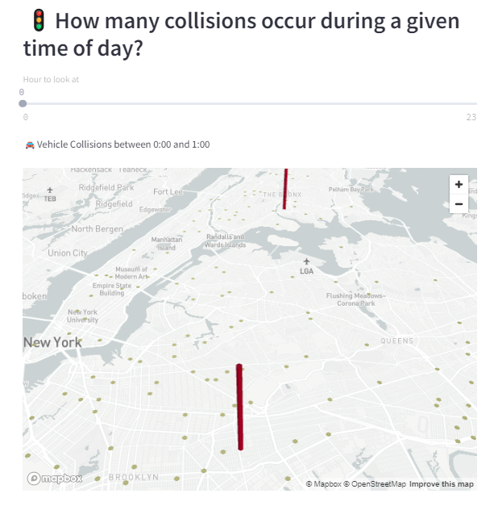
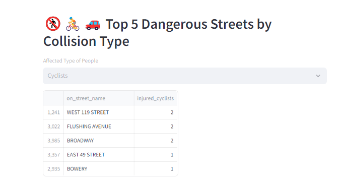

All apps created using Streamlit and Python

🚗 Motor Vehicle Collisions in NYC app.

<H3>Requirements</H3>
* streamlit | * pandas | * numpy | * pydeck | * plotly

<H3>Version</H3>
Python 3.12.1 | Streamlit

<H3>Deployments</H3>
https://data-science-collision.streamlit.app/

<H3>Show Me</H3>

 
 

 Credit: This app was inspired by the "Build a Data Science Web App with Streamlit and Python" hands-on project | 
<a href="https://www.coursera.org/projects/data-science-streamlit-python/">Coursera</a>
